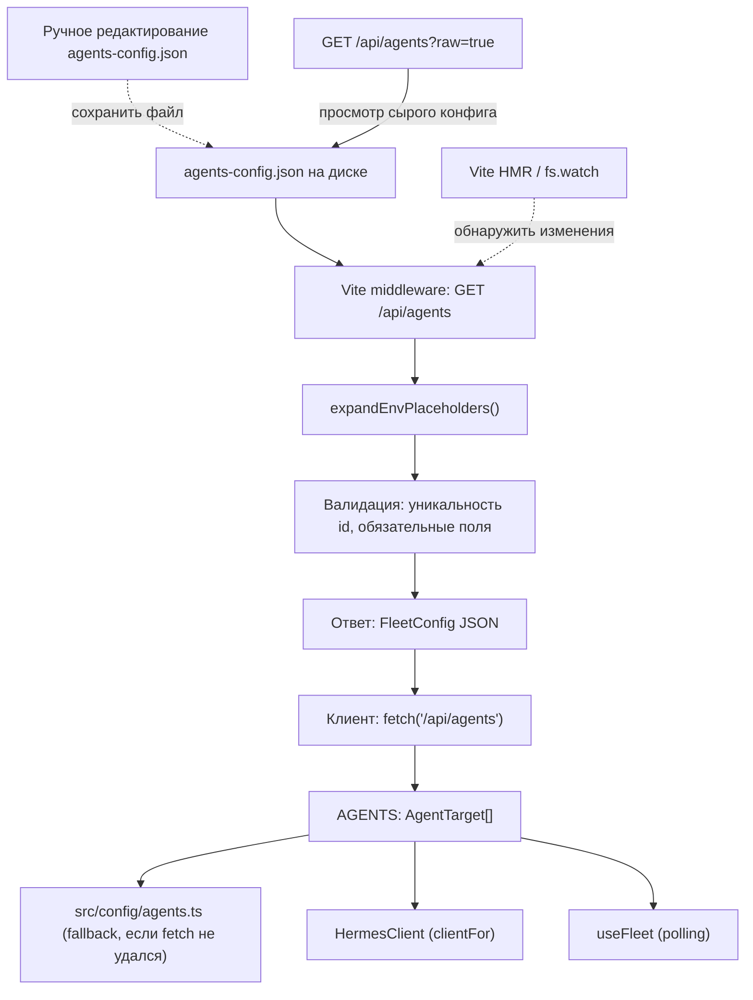

# План: JSON-конфигурация агентов Hermes (по образцу kosmos-panel)

**Дата:** 2026-08-07
**Источник:** анализ [`kosmos-panel`](C:\ERV\projects-ex\kosmos-panel) → адаптация для [`hermes_plus`](.)

---

## 1. Что делает kosmos-panel и что мы заимствуем

### Структура конфигурации kosmos-panel

| Файл | Назначение |
|------|-----------|
| [`inventory.json`](C:\ERV\projects-ex\kosmos-panel\inventory.json.example) | Серверы + сервисы + креды + poll-настройки |
| [`config.json`](C:\ERV\projects-ex\kosmos-panel\config.json.example) | Настройки приложения (AI-модель, промпты) |
| [`inventory-json-mapping.json`](C:\ERV\projects-ex\kosmos-panel\inventory-json-mapping.json) | Описание дерева для JSON-редактора |

### Ключевые механики (которые мы переносим)

1. **JSON-файл как единственный источник правды** — агенты описаны декларативно в [`agents-config.json`](agents-config.json), не в коде
2. **Подстановка env-переменных `${VAR_NAME}`** — чувствительные данные никогда не лежат в JSON литералами; вместо них — плейсхолдеры, которые раскрываются через `process.env` / `import.meta.env`
3. **Hot-reload без перезапуска** — Vite-сервер перечитывает файл при изменении; клиент подхватывает через middleware
4. **API для просмотра** — `GET /api/agents` через Vite middleware отдаёт конфиг с раскрытыми переменными
5. **Пример файла** — [`agents-config.json.example`](agents-config.json.example) с подробными комментариями

### Что НЕ переносим (пока)

- SSH-мониторинг сервисов (domain-specific для kosmos-panel)
- JSON-редактор в UI (SuperJsonEditor) — не нужно, YAGNI
- API для сохранения конфига через UI — редактирование только вручную
- Механизм credentials (у нас свои auth-типы: session-token / cookie / bearer)

---

## 2. Целевая архитектура

### 2.1. Новый файл: `agents-config.json` (корень проекта, коммитится)

```jsonc
// agents-config.json — реестр Hermes-агентов (fleet config).
// Чувствительные данные — только через ${ENV_VAR}, никогда литералами.
// Версия: 0.1.0
{
  "agents": [
    {
      "id": "local:projects-ex",
      "name": "Local Hermes / projects-ex",
      "baseUrl": "",
      "profile": "projects-ex",
      "auth": { "type": "session-token" },
      "tags": ["local", "main"]
    },
    {
      "id": "local:default",
      "name": "Local Hermes / default",
      "baseUrl": "",
      "profile": "default",
      "auth": { "type": "session-token" },
      "tags": ["local"]
    },
    {
      "id": "l1:default",
      "name": "L1 Hermes / default (192.168.1.221)",
      "baseUrl": "",
      "proxyPath": "/l1",
      "profile": "default",
      "auth": {
        "type": "cookie",
        "username": "${VITE_HERMES_L1_USERNAME}",
        "password": "${VITE_HERMES_L1_PASSWORD}"
      },
      "tags": ["lan", "l1"]
    }
  ]
}
```

### 2.2. Поток данных



### 2.3. Где живёт логика

| Слой | Файл | Ответственность |
|------|------|----------------|
| **Данные** | `agents-config.json` (корень) | Декларативное описание агентов |
| **Пример** | `agents-config.json.example` (корень) | Документированный шаблон |
| **Middleware** | [`vite.config.ts`](vite.config.ts) (изменяемый) | `GET /api/agents` — чтение JSON + env-подстановка |
| **Загрузка (клиент)** | `src/config/loadAgents.ts` (новый) | `fetch('/api/agents')` → `AgentTarget[]` |
| **Адаптер** | `src/config/agents.ts` (изменяемый) | Экспорт `AGENTS`: пробует загрузить из middleware, fallback на хардкод |
| **Типы** | `src/types/agent.ts` (уже есть) | `AgentTarget`, `AgentAuth`, `FleetConfig` |

---

## 3. Пошаговый план реализации

### Шаг 1: `agents-config.json.example` — шаблон конфигурации

Создать в корне. Содержит:
- Все поля задокументированы (как в [`inventory.json.example`](C:\ERV\projects-ex\kosmos-panel\inventory.json.example))
- Примеры для каждого типа auth: `session-token`, `cookie`, `bearer`, `none`
- Комментарий про `${ENV_VAR}` — чувствительные данные только через env
- Текущие 3 агента как пример

### Шаг 2: `agents-config.json` — рабочий файл

Создать в корне. **Коммитится** (не в `.gitignore`). Содержит реальных агентов с `${VITE_XXX}` плейсхолдерами для чувствительных данных.

### Шаг 3: Middleware в [`vite.config.ts`](vite.config.ts)

Добавить кастомный middleware в секцию `server.proxy` или через Vite plugin:

```ts
// В vite.config.ts → configureServer()
{
  name: 'hermes-agents-config',
  configureServer(server) {
    server.middlewares.use('/api/agents', async (req, res) => {
      if (req.method === 'GET') {
        const raw = fs.readFileSync(
          path.resolve(__dirname, 'agents-config.json'), 'utf-8'
        );
        const expanded = expandEnvPlaceholders(JSON.parse(raw));
        // Валидация
        res.setHeader('Content-Type', 'application/json');
        res.end(JSON.stringify(expanded));
      }
    });
  }
}
```

Функция `expandEnvPlaceholders()` — в отдельном файле [`src/config/envSubst.ts`](src/config/envSubst.ts) (чистая функция, без Node.js-зависимостей):
- Рекурсивный обход объекта
- Замена `${VITE_XXX}` → `import.meta.env.VITE_XXX`
- Замена `${XXX}` → `import.meta.env.XXX` (для не-VITE переменных)

### Шаг 4: `src/config/envSubst.ts` — подстановка env

```ts
/**
 * Рекурсивная подстановка переменных окружения в строковые значения.
 * Поддерживает ${VAR_NAME} синтаксис.
 * Работает и в браузере (import.meta.env), и в Node (process.env).
 */
export function expandEnvPlaceholders<T>(obj: T): T {
  // ... рекурсивный обход, замена ${...} на значения из env
}
```

### Шаг 5: `src/config/loadAgents.ts` — клиентская загрузка

```ts
import type { AgentTarget } from '../types/agent';

/**
 * Загружает список агентов через Vite middleware.
 * При неудаче возвращает null — вызывающий код использует fallback.
 */
export async function loadAgentsFromConfig(): Promise<AgentTarget[] | null> {
  try {
    const res = await fetch('/api/agents');
    if (!res.ok) return null;
    const data = await res.json();
    return data.agents ?? null;
  } catch {
    return null;
  }
}
```

### Шаг 6: Адаптировать `src/config/agents.ts`

Текущий файл с [`AGENTS`](src/config/agents.ts:14) остаётся fallback-ом:

```ts
import type { AgentTarget } from '../types/agent';
import { loadAgentsFromConfig } from './loadAgents';

// Хардкод-фолбэк (текущие 3 агента) — используется если agents-config.json
// недоступен или middleware не отвечает
const FALLBACK_AGENTS: AgentTarget[] = [
  /* ... текущий массив из agents.ts ... */
];

// Ленивая инициализация: при первом обращении пытаемся загрузить из JSON
let _agents: AgentTarget[] | null = null;

export async function getAgents(): Promise<AgentTarget[]> {
  if (_agents) return _agents;
  const fromJson = await loadAgentsFromConfig();
  _agents = fromJson ?? FALLBACK_AGENTS;
  return _agents;
}

// Синхронный доступ для совместимости (использует кэш или fallback)
export function getAgentsSync(): AgentTarget[] {
  return _agents ?? FALLBACK_AGENTS;
}

// Устаревший экспорт для обратной совместимости
export const AGENTS: AgentTarget[] = FALLBACK_AGENTS;
```

### Шаг 7: Обновить [`useFleet.ts`](src/hooks/useFleet.ts)

Хук должен использовать `getAgents()` вместо прямого импорта `AGENTS`:

```ts
// Было:
import { AGENTS } from '../config/agents';

// Стало:
import { getAgents } from '../config/agents';

// Внутри хука:
const agents = await getAgents();
```

### Шаг 8: Обновить документацию

- [`KB/README_FLEET.md`](KB/README_FLEET.md) → секция «JSON-конфигурация»: формат файла, как добавить агента, env-переменные
- [`KB/README_DEV.md`](KB/README_DEV.md) → упомянуть `agents-config.json` и middleware `/api/agents`

---

## 4. Сравнение: было → стало

| Аспект | Было ([`agents.ts`](src/config/agents.ts)) | Стало (`agents-config.json`) |
|--------|-----------------|---------------------|
| Добавление агента | Редактировать TS-файл, пересборка | Редактировать JSON, обновить страницу |
| Чувствительные данные | `import.meta.env` прямо в коде | `${VITE_XXX}` в JSON, раскрывается middleware |
| Валидация | TypeScript на этапе сборки | Runtime-валидация в middleware |
| Расшаривание конфига | Нельзя (креды в коде) | `agents-config.json.example` — безопасно |
| Backward compatibility | — | Fallback на хардкод |
| Коммит | Всегда (это код) | Да (JSON с плейсхолдерами, без реальных кредов) |

---

## 5. Структура файлов после изменений

```
hermes_plus/
├── agents-config.json            # новый: рабочий конфиг агентов (коммитится)
├── agents-config.json.example    # новый: шаблон с документацией
├── vite.config.ts                # изменить: middleware GET /api/agents
├── src/
│   ├── config/
│   │   ├── agents.ts             # изменить: загрузка из JSON + fallback
│   │   ├── loadAgents.ts         # новый: fetch('/api/agents') → AgentTarget[]
│   │   └── envSubst.ts           # новый: expandEnvPlaceholders()
│   ├── hooks/
│   │   └── useFleet.ts           # изменить: использовать getAgents()
│   └── types/
│       └── agent.ts              # без изменений (типы уже готовы)
├── KB/
│   ├── README_FLEET.md           # изменить: секция JSON-конфигурации
│   └── README_DEV.md             # изменить: agents-config.json, middleware
```

---

## 6. Что именно делаем (checklist)

1. Создать [`agents-config.json.example`](agents-config.json.example) — шаблон с документацией
2. Создать [`agents-config.json`](agents-config.json) — рабочий конфиг (текущие 3 агента)
3. Создать [`src/config/envSubst.ts`](src/config/envSubst.ts) — `expandEnvPlaceholders()`
4. Добавить middleware в [`vite.config.ts`](vite.config.ts) — `GET /api/agents`
5. Создать [`src/config/loadAgents.ts`](src/config/loadAgents.ts) — `fetch('/api/agents')`
6. Изменить [`src/config/agents.ts`](src/config/agents.ts) — загрузка из JSON + fallback
7. Изменить [`src/hooks/useFleet.ts`](src/hooks/useFleet.ts) — использовать `getAgents()`
8. Обновить [`KB/README_FLEET.md`](KB/README_FLEET.md) — секция про JSON-конфиг
9. Обновить [`KB/README_DEV.md`](KB/README_DEV.md) — упомянуть новый файл и middleware
